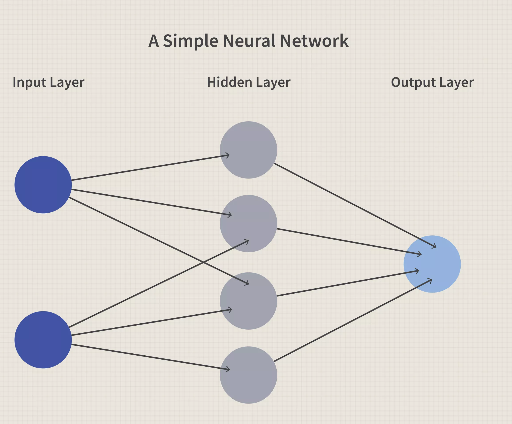
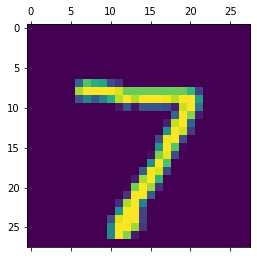
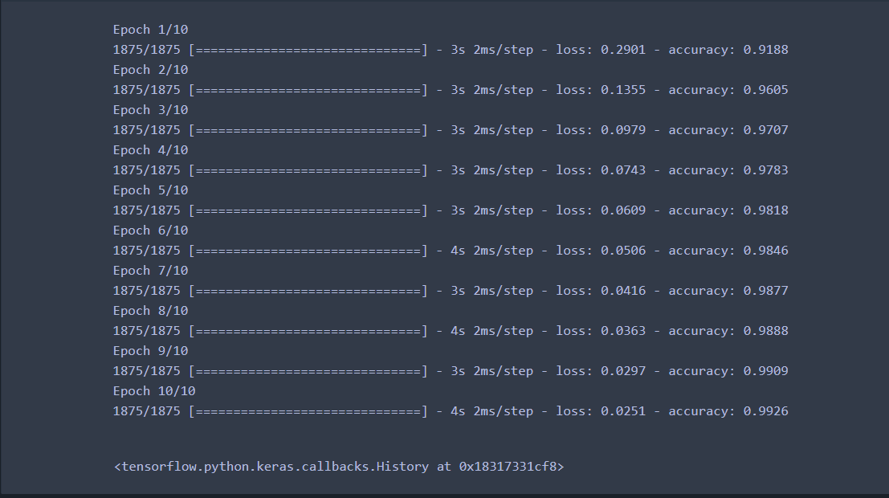

# Keras handwritten digits dataset classified using Neural Network

Keras provide provide a datasets of hand written images of digits in 28*28 size

# Objective
To classify image of a digit into 0-9 output classes

# Dataset
Keras digits dataset, containing 70000 images of digits hand written in 28*28 size

# Model used
Keras sequential neural network with 1 hidden layer

# Neural Network

A neural network is a series of algorithms that endeavors to recognize underlying relationships in a set of data through a process that mimics the way the human brain operates. 
In this sense, neural networks refer to systems of neurons, either organic or artificial in nature. 
Neural networks can adapt to changing input; so the network generates the best possible result without needing to redesign the output criteria. 

Example of an image to be classified

In Keras neural network model few parameters are to be checked:
1. Input shape - It is required to have a single array instead of 2D or 3D
2. Hidden layer - If specified (recommended) requires a network of neurons to work with algorithms such as Forward pass or back propagation
3. Activation Function - Can be used from Linear/ Relu/ Tanh/ Sigmoid
4. Ouput layer - Containing the classes

Generally it is advisable to use hidden layers as many as possible to increase the interactions between neurons and hence reduce the error

# Gradient Descent or Optimizer
The gradient is a numeric calculation allowing us to know how to adjust the parameters of a network in such a way that its output deviation is minimized

# Types of Gradient Descent

1. Batch gradient descent - Weights and bias is calculated and adjusted after every epoch
2. Stochastic gradient descent - Weights and bias is calculated and adjusted after every training sample instead of epoch
3. (Stochastic) Mini-batch gradient descent - Instead of every sample, a group of samples are executed and weights/bias is calculated accordingly

In large datasets such as this, its inefficient to use batch gradient descent hence stochastic gradient descent is preferred.

# Model performance

Deployed neural network model and reached an accuracy of 99.26%

# Evaluation and conclusion

Model showed an improvement an accuracy corresponding to higher number of neurons and hidden layers.

